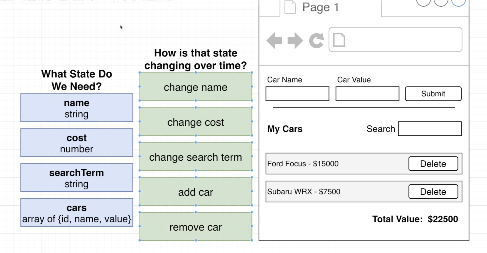

To preview:
press: Cmd/k 
then let go of they keys and press: v

Add image: 
add the image to the root of our folder, then drag it and hold the sfit key that allow you to specify where you want to drop it

----------------------------
----------------------------

##### For each of the different green boxes we're going to create a different mini reducer function inside one of our different slices.And give them names that correspond with what we have stated here.

---------------------------------
---------------------------------

#### CONNECTION REACT TO REDUX  --- ( Done once per project )
###### 1- Export the ”store” from whatever file it is created in.
###### 2- Import the ”store” into the root ”index.js” file.
###### 3- Import ”Provider” from the react-redux library into the root ”index.js” file.
###### 4- Wrap the App component with the provider, pass the ”store” as a prop called store to the Provider

---------------------------------
---------------------------------
####  CHANGING OUR STATE --- ( Done may times per project whenever we want to update our state )
###### 1- Add a reducer to one of our slices that changes state in some particular way
###### 2- Export the action creator that the slice automatically creates
###### 3- Find the component that you want to dispatch from
###### 4- Import the action creator function and ”useDispatch” from react-redux
###### 5- Call the ”useDispatch” hook to get access to the dispatch function
###### 6- Whenever the user does something like running an event handler, call the action creator to get an action, then dispatch it.
---------------------------------
---------------------------------
#### ACCESSING OUR STATE: --- ( Done many times per project )whenever we want to access some state from inside of a component.
###### 1- Find the component that needs to access some state
###### 2- Import the "useSelector" hook from react-redux
###### 3- Call the "useSelector" hook, passing in the selector function
###### 4- Use the state! Any time state changes, the component will automatically rerender
---------------------------------
---------------------------------
#### +++ IMPORTANT NOTE about STATE +++
Whenever we refer to state inside of our slice, it means the state that this slice is in control of which in movieSlice
is the array of movies and in songSlice is he array of songs.
Everywhere else outside of our slice "state" refers to all the states within the entire Redux store.